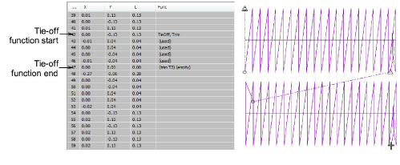

# Add tie-offs

|  | Click Function > Insert Tie-Off to insert a tie-off. |
| -------------------------------------------- | ---------------------------------------------------- |

You can add tie-offs in your design using the Tie-Off tool. This provides a semi-automated technique for adding tie-offs as an alternative to digitizing them with manual stitches. Tie-offs are usually added before a trim at the end of an object. Generally you will follow a tie-off with a trim.

## To add a tie-off...

1Travel to the object you want to tie-off.

2Click the Insert Tie-off icon. A Tie-off function is inserted.

The default number of tie-off stitches is two. This means the needle backtracks twice and returns to the insertion point. Adjust this value in the Object Properties > Connectors docker.

Tip: You can also insert [machine functions](../../glossary/glossary) manually using the Insert Machine Function dialog.

## Related topics...

- [Viewing stitching sequence](../../Basics/view/Viewing_stitching_sequence)
- [Add trims](Add_trims)
- [Insert machine functions manually](../../Modifying/functions/Insert_machine_functions_manually)
- [Automatic tie-off settings](Automatic_tie-off_settings)
