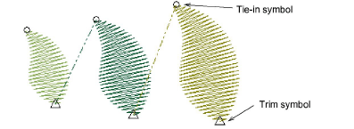

# Add trims

|  | Click Function > Insert Trim to insert a trim. |
| ---------------------------------------- | ---------------------------------------------- |

You can add trims in your design using the Trim tool. When you add a trim in this way, the trim function is added to the current stitch. Some machines require [empty stitches](../../glossary/glossary) or [empty jumps](../../glossary/glossary) on either side of the trim. If this is the case for the machine you want to stitch to, you will need to insert them.

Tip: Make sure that all stitches you trim have been tied in and off, otherwise stitches will not be secured.

## To add a trim...

1Travel to the needle position where you want to trim the thread.

2Click the Insert Trim icon. A trim function is inserted at the current needle position.

Tip: You can also insert [machine functions](../../glossary/glossary) manually using the Insert Machine Function dialog.

## Related topics...

- [Travel through designs](../../Basics/view/Travel_through_designs)
- [Insert machine functions manually](../../Modifying/functions/Insert_machine_functions_manually)
