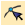
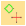
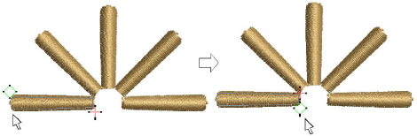
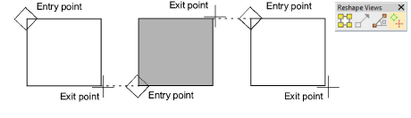

# Adjust entry/exit points

|  | Use Reshape Object to adjust the entry and exit points of selected objects.                                       |
| ---------------------------------------------- | ----------------------------------------------------------------------------------------------------------------- |
|  | Use Reshape Views > Show Entry/Exit Points to toggle entry/exit point display when using the Reshape Object tool. |

EmbroideryStudio allows you to manually change [entry ](../../glossary/glossary)and [exit](../../glossary/glossary#exit) points of individual objects. Entry and exit points should always be checked if you are re-sequencing objects in a design.

::: tip
Closest joins are not automatically maintained when objects are moved, re-sequenced, or edited. The Apply Closest Join feature allows you to automatically re-apply closest joins to objects after editing.
:::

## To adjust entry/exit points...

- Select an object and click Reshape Object.
- Click Show Entry/Exit to view only entry and exit points.
- To view next or previous objects, press Tab or Shift+Tab keys. Any changes to objects are confirmed.
- Select entry or exit points of adjoining objects and drag into close proximity.

- Press Enter.

::: tip
If you are digitizing adjoining columns, optionally keep or omit the last stitch in the first column to achieve a smoother join or shorter connecting stitches.
:::

## Related topics...

- [Sequencing embroidery objects](../../Modifying/combine/Sequencing_embroidery_objects)
- [Keeping or omitting last stitches](Keeping_or_omitting_last_stitches)
- [Other general options](../../Setup/settings/Other_general_options)
