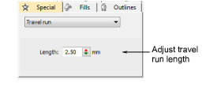
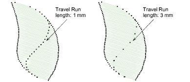

# Adjusting travel run stitch length

|  | Use Docker > Object Properties to toggle the Object Properties docker on/off. Use it to set the travel run stitch length. |
| -------------------------------------------------------------- | ------------------------------------------------------------------------------------------------------------------------- |

Travel runs are usually used to connect segments within filled objects. They are usually covered by fill stitches when the object is stitched out. You can adjust the travel run length to reduce the stitch count.

## To adjust travel run stitch length...

1. Click the Object Properties icon.

2. Select the Special tab and Travel Run from the list.

3. Enter a value in the Length field as required.

Tip: Increase stitch length to reduce the stitch count. Travel Run automatically varies the stitch length on tight curves.
