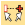
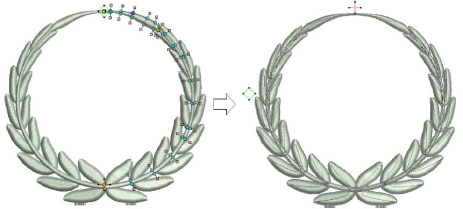
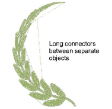
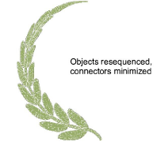

# Apply automatic branching

|  | Click Arrange > Branching to automatically sequence and group like embroidery objects. |
| -------------------------------------- | -------------------------------------------------------------------------------------- |

Apply Branching to selected objects. These become a single branched object.

## To apply automatic branching...

1. Select the objects.

Note: The function is only available if more than one object of any suitable type is selected.

2. Click the Branching icon. EmbroideryStudio will prompt you to digitize entry and [exit points](../../glossary/glossary).

3. Digitize entry and exit points, or press Enter twice to accept the [defaults](../../glossary/glossary).

Component objects are grouped and share the color of the first branched object. Objects are resequenced, [connectors](../../glossary/glossary) minimized, and stitches regenerated.

4. Travel through the branched object to check stitching.

## Related topics...

- [Travel through designs](../../Basics/view/Travel_through_designs)
