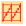
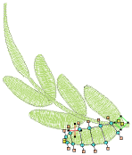
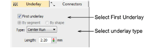
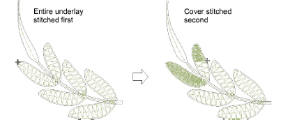

# Apply automatic underlay to branched objects

|  | Right-click Stitch Effects > Auto Underlay to select an underlay type to apply to branched objects. |
| -------------------------------------------- | --------------------------------------------------------------------------------------------------- |

Because Branching combines objects to form a single branched object, you may be able to apply a single underlay to the entire object. The technique works well with Column A or Column B objects.

## To apply automatic underlay to branched objects...

1Select the branched object and right-click Auto Underlay.

2Select the First Underlay checkbox and select an underlay type.

3Optionally, add a second underlay.

4Press Enter or click Apply. Underlay stitches are automatically generated for the branched object.

Note: If component objects are touching or overlapping, the underlay is first stitched out for the whole branched object followed by the cover stitch.

## Related topics...

- [Viewing stitching sequence](../../Basics/view/Viewing_stitching_sequence)
