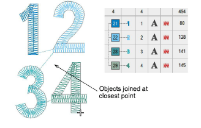
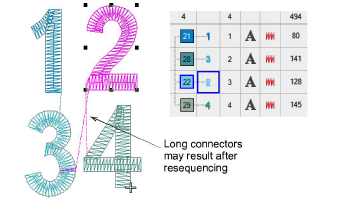
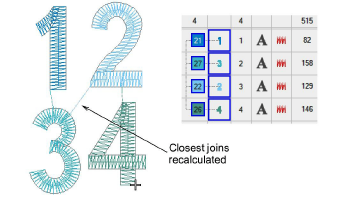
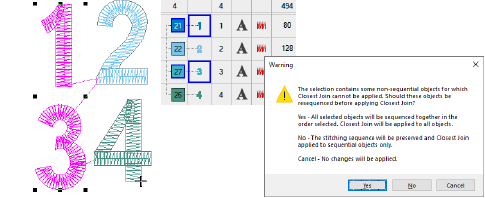
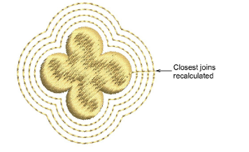

# Apply closest join

|  | Use Arrange > Apply Closest Join to (re-)apply closest join to objects after editing. |
| ---------------------------------------------------- | ------------------------------------------------------------------------------------- |

When you are digitizing closed objects, the Closest Join method automatically calculates the closest join between them, saving you having to think about entry and exit points. The Apply Closest Join feature allows you to (re-)apply closest join to objects after editing. The command may be accessed via:

- Toolbar button on the Arrange toolbar
- Arrange menu
- Design Window popup menu
- Color-Object List popup menu
- Shortcut key (J)

Note: The Apply Closest Join command is only enabled when two or more embroidery objects are selected.

## To apply closest join...

- Digitize embroidery objects as required.

If the Closest Join method has been activated via the Setup (or Standard toolbar) > Options > General docker, entry and exit points of objects are automatically joined at the closest point.

- Move, reshape, and/or resequence objects in the design as required.

Closest join is not recalculated automatically – long connectors may result.

- Select all objects in the sequence and reapply closest join – click Apply Closest Join or choose the command from the popup menu.

Selected embroidery objects are regenerated and Closest Join applied.

Caution: Any non-sequential embroidery objects in the selection will cause a message to be displayed:

Tip: Apply Closest Join also to generated offset objects.

## Related topics...

- [Other general options](../../Setup/settings/Other_general_options)
- [Generating outlines & offsets](../../Modifying/productivity/Generating_outlines_offsets)
