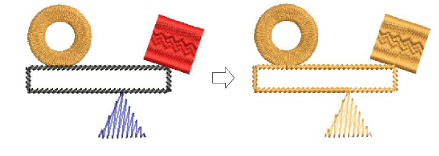

# Automatic branching

The Branching feature lets you digitize like objects – e.g. the fingers of a hand, sections of a custom letter – without having to think about the most efficient stitching sequence and joins. Apply Branching to join touching or overlapping objects to form a single ‘branched object’.

## Characteristics of branched objects

- Objects are resequenced, [connectors](../../glossary/glossary) minimized, component objects grouped, and stitches regenerated.
- When dissimilar objects are selected, any which cannot be branched are omitted.
- All component objects are grouped and selectable as one.
- Branched objects can be reshaped.
- There is a single entry and one [exit point](../../glossary/glossary) but all component objects have individual reshape points.
- Branched objects preserve their component [object properties](../../glossary/glossary) while sharing the color of the first object in the sequence.

- Branching works with any combination of the following object types – Run, Column A, [Column B](../../glossary/glossary), [Column C](../../glossary/glossary), [Complex Fill](../../glossary/glossary) and Complex Turning. Objects with [Motif Run](../../glossary/glossary) and [Motif Fill](../../glossary/glossary) cannot be used.
- Stitch types can be re-assigned via the toolbar.

## Related topics...

- [Apply automatic branching](Apply_automatic_branching)
- [Branch objects with the Color-Object List](Branch_objects_with_the_Color-Object_List)
