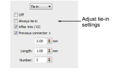

# Automatic tie-in settings

|  | Use Docker > Object Properties to toggle the Object Properties docker on/off. |
| -------------------------------------------------------------- | ----------------------------------------------------------------------------- |

Tie-in stitches are inserted at the start of objects to prevent stitches from unraveling. They are inserted inside the shape on the second stitch. You generally use them when the previous connector is trimmed.

## To adjust tie-in settings...

1. Click the Object Properties icon.

2. Select the Connectors tab.

3. Select Tie In from the list and select a tie-in option:

| Option             | Function                                                                         |
| ------------------ | -------------------------------------------------------------------------------- |
| Off                | No tie-ins are inserted.                                                         |
| Always tie in      | Tie-ins are inserted before the object.                                          |
| After Trim/CC      | Tie-ins are inserted after trims and color changes.                              |
| Previous connector | Tie-ins are inserted when the previous connector exceeds the length you specify. |

4. Set tie-in values:

| Option | Function                                          |
| ------ | ------------------------------------------------- |
| Length | Determines length of tie-in stitches.             |
| Number | Determines number of tie-in stitches to generate. |
