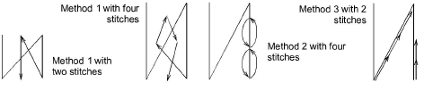
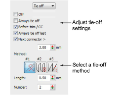

# Automatic tie-off settings

|  | Use Docker > Object Properties to toggle the Object Properties docker on/off. |
| -------------------------------------------------------------- | ----------------------------------------------------------------------------- |

With trims, stitches need to be tied off so the thread can be trimmed without unraveling. Select between automatic tie-off methods to set preferred default.

Method 2 is generally more visually pleasing on smaller objects and satin columns. With this method, however, stitches sew on top of each other with the consequent risk of thread breakage. On larger areas, the safer alternative is Method 1\. Method 3 provides an alternative method for hiding tie-offs along existing stitch lines.

Tip: For narrow shapes or columns – e.g. small lettering – use only one tie-off stitch. You may also decrease the stitch length.

## To adjust tie-off settings...

1Click the Object Properties icon and select the Connectors tab.

2In the Tie Off panel, select a tie-off option:

| Option                     | Function                                                                                                                                    |
| -------------------------- | ------------------------------------------------------------------------------------------------------------------------------------------- |
| Off                        | No tie-off is inserted. By selecting this option, you need to add tie-off functions manually. [See Add tie-offs for details.](Add_tie-offs) |
| Always tie off             | A tie-off is inserted after the object.                                                                                                     |
| Before trim / color change | A tie-off is inserted before a trim or color change.                                                                                        |
| Always tie off last        | A tie-off is inserted if the object is the last one in the design.                                                                          |
| Next connector longer than | A tie-off is inserted if the next connector exceeds the specified length.                                                                   |

3Select a default tie-off method. The system will apply this method where it can but switch where necessary, depending on stitch spacing and type.

| Method | Function                                                                                                                                         |
| ------ | ------------------------------------------------------------------------------------------------------------------------------------------------ |
| 1      | Adds a specified number of small stitches between the last two stitching lines. Generally used with dense fills.                                 |
| 2      | Adds a specified number of small stitches up and back down the last stitching line. Generally used with open fills where it is less visible.     |
| 3      | Splits the second-last stitching line into three equal stitches. Also adds a specified number of small stitches back up the last stitching line. |

4Set the tie-off values:

| Option | Function                                           |
| ------ | -------------------------------------------------- |
| Length | Determines length of tie-off stitches.             |
| Number | Determines number of tie-off stitches to generate. |
