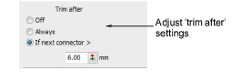

# Automatic trim settings

|  | Use Docker > Object Properties to toggle the Object Properties docker on/off. |
| -------------------------------------------------------------- | ----------------------------------------------------------------------------- |

You can choose to turn off automatic trimming, to always trim connecting stitches, or to trim only when the connecting stitch is longer than a specified value.

## To adjust automatic trim settings...

1. Click the Object Properties icon and select the Connectors tab.

2. In the Trim After panel, select a trim option:

| Option                                | Function                                                                                                                                                                                                        |
| ------------------------------------- | --------------------------------------------------------------------------------------------------------------------------------------------------------------------------------------------------------------- |
| Off                                   | No trims are inserted. This feature is useful if trimming causes your machine to slow down, or the needle to lose the thread. You can either add trim functions yourself, or trim the final embroidery by hand. |
| Always trim                           | Trims are inserted after the object.                                                                                                                                                                            |
| Trim if next connector is longer than | Trims are inserted if the next connector exceeds the length you specify.                                                                                                                                        |

Tip: Usually, connectors shorter than 3 mm are not visible on the final embroidery. You may sometimes require a smaller value – e.g. if the thread color contrasts with the [background](../../glossary/glossary) color.
