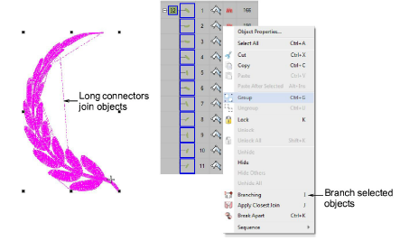
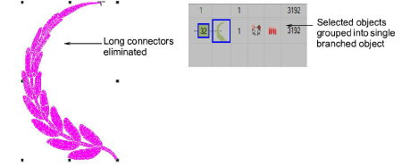

# Branch objects with the Color-Object List

|  | Use Docker > Color-Object List to branch selected objects in a design. |
| -------------------------------------------------- | ---------------------------------------------------------------------- |

The Color-Object List provides an easy way to select objects in designs and access their [properties](../../glossary/glossary). You can use it to branch like objects in a design.

## To apply branching with the Color-Object List...

1Click the Color-Object List icon.

2Select objects in the Color-Object List.

3Right-click and select Branching from the popup menu.

Note: The function is only available if more than one object of any suitable type is selected.

4Digitize entry and [exit points](../../glossary/glossary), or press Enter twice to accept the [defaults](../../glossary/glossary).

Component objects are grouped and share the color of the first branched object. Objects are resequenced, [connectors](../../glossary/glossary) minimized, and stitches regenerated.

Tip: Use the Color-Object List also to cut, copy and paste, group and ungroup, lock and unlock, and show and hide objects, as well as resequence objects.

## Related topics...

- [Combining Objects](../../Modifying/combine/Combining_Objects)
