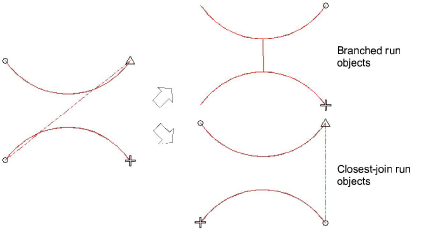

# Closest join limitations

The Apply Closest Join feature is not applicable to all objects in all circumstances. Note the following limitations.

## Stitch regeneration

Closest Join requires the complete stitch regeneration of the objects – the whole object, not just connectors. Stitch regeneration has its limitations:

- Recognized objects – i.e. opened from machine files – may generate poor or incorrect embroidery.
- Manual (unrecognized) objects cannot be changed by stitch regeneration. Thus Closest Join will not work properly for them.
- Manual stitch edits to objects will be lost.
- Inserted and recognized machine functions may be mistakenly regenerated on the underlay.
- Nested objects are not supported. They will become un-nested and placed after the object in which they were originally nested. This may not produce ideal sequence.

## Run objects

The Closest Join technique is not as powerful as Branching for run objects. Closest Join will not produce a nicely-merged double-run, so connectors are only possible at the ends of the run, not in the middle. The best it can do is swap the ends of the runs.

