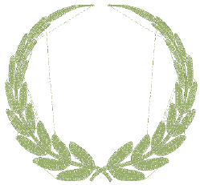

# Embroidery Connectors

Connectors link objects in a design. They can be run stitches or jumps. Travel runs are also used to connect segments within filled objects.

You can use automatic settings to generate [connectors](../../glossary/glossary#connectors), trims and tie-offs, or add them manually. You can change connector settings for a whole design or selected objects. If you prefer to add tie-offs and trims as you digitize, you can turn off automatic connectors altogether. For Schiffli work, for example, you are advised to add connectors manually rather than rely on automatic settings.

EmbroideryStudio also allows you to create ‘branched objects’. Like-objects are thereby resequenced, connectors minimized, components grouped, and stitches regenerated. Underlay can be applied to all.

You can also set first and last stitches of a design. This makes it easy to position the needle before stitching, and reduces the chance of it hitting the frame.

## Related topics...

- [Types of connectors](Types_of_connectors)
- [Using automatic connectors](Using_automatic_connectors)
- [Adding connectors manually](Adding_connectors_manually)
- [Adjusting travel run stitch length](Adjusting_travel_run_stitch_length)
- [Keeping or omitting last stitches](Keeping_or_omitting_last_stitches)
- [Minimizing connectors](Minimizing_connectors)
- [Automatic branching](Automatic_branching)
