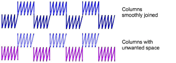
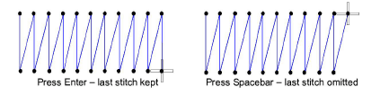

# Keeping or omitting last stitches

|  | Click Reshape > Keep Last Stitch to keep the last stitch in a column. |
| ------------------------------------------------ | --------------------------------------------------------------------- |
|  | Click Reshape > Omit Last Stitch to omit the last stitch in a column. |

If you are digitizing adjoining columns, you can keep or omit the last stitch in the first column to achieve a smoother join or shorter connecting stitches.

::: info Note
This feature only applies when the [exit point](../../glossary/glossary#exit-point) is at the end of the column – i.e. the default exit point. Moving the exit point using the Reshape Object tool overrides the Keep Last Stitch/Omit Last Stitch command.
:::

## To keep or omit the last stitch...

- To keep the last stitch, select the object and click the Keep Last Stitch icon.
- To omit the last stitch, select the object and right-click the Omit Last Stitch icon.

::: tip
Alternatively press Spacebar to omit the last stitch or Enter keep it.
:::

## Related topics...

- [Apply closest join](Apply_closest_join)
