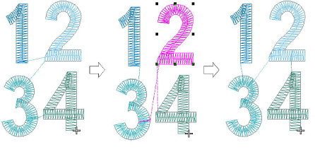

# Minimizing connectors

Designs stitch out more efficiently when the [connectors](../../glossary/glossary) between objects are short. This also reduces the number of trims in a design. EmbroideryStudio has a Closest Join method which is set via the Setup (or Standard toolbar) > Options > General tab. When activated (the default), entry and exit points of objects are automatically placed when the user digitizes new objects.

However, closest joins are not automatically maintained when objects are moved, re-sequenced, or edited. The Apply Closest Join feature allows you to (re-)apply closest joins to objects after editing. EmbroideryStudio also allows you to manually change [entry ](../../glossary/glossary)and [exit](../../glossary/glossary) points of individual objects.

## Related topics...

- [Adjust entry/exit points](Adjust_entry_exit_points)
- [Apply closest join](Apply_closest_join)
- [Closest join limitations](Closest_join_limitations)
