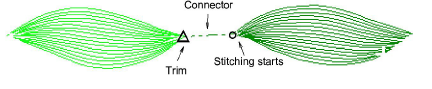

# Types of connectors

The type of connector you use depends on whether you want it to be visible in the final design. The [default](../../glossary/glossary) connector setting in EmbroideryStudio is for jumps.

## Jumps

Jumps move the frame from one part of the design to another without needle penetrations. You can use automatic jumps as [connectors](../../glossary/glossary) between embroidery objects. The connecting thread generally needs to be tied-off and trimmed. The default connector jump length is the same as that set for Auto Jump.

Tip: You can also digitize jumps manually using the Penetrations function or with Manual stitch.

## Runs

Travel runs are typically used to connect segments of complex shapes. They can also connect adjacent objects. Because runs are not trimmed, they may be visible in the final embroidery. If objects are adjacent and connectors will be hidden, they can be used. You can change the stitch length of travel runs to ensure they do not protrude from the cover stitching. You may also adjust the travel run length to reduce the stitch count.

Note: While you can control the properties of run connectors between objects, you generally cannot control connectors within objects. Lettering and motif run objects are the exception.

## Tie-ins

Tie-in stitches are inserted at the start of objects to prevent stitches from unraveling. They are inserted inside the shape on the second stitch. You generally use them when the previous connector is trimmed.

## Tie-offs

Tie-offs are generally placed before trims to prevent stitches from unraveling. You can adjust connector settings to automatically add tie-offs under certain conditions, or add them manually. You can also include trim functions so machines with trimmers cut the thread automatically.

## Trims

If you are using a machine with an automatic trimmer, the trim function causes the thread to be cut after a tie-off. In the software, trims are represented by a triangle with a small circle at the point where stitching starts again. The trimmed connector appears as a dotted line. You can adjust connector settings to automatically add trims, or add them yourself.

## Related topics...

- [Add jumps with penetrations off](Add_jumps_with_penetrations_off)
- [Digitizing manual stitches](../../Modifying/functions/Digitizing_manual_stitches)
- [Adjusting travel run stitch length](Adjusting_travel_run_stitch_length)
