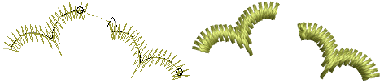
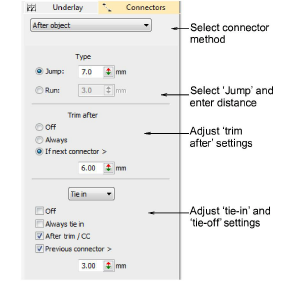

# Use jumps as connectors

|  | Use Docker > Object Properties to toggle the Object Properties docker on/off. Use it to set jumps as connectors. |
| ---------------------------------------------------- | ---------------------------------------------------------------------------------------------------------------- |

You can use automatic jumps as [connectors](../../glossary/glossary) between embroidery objects. Jumps move the frame from one part of the design to another without needle penetrations. You generally need to tie-off and trim the connecting thread.

## To use jumps as connectors...

1. Click the Object Properties icon and select the Connectors tab.

2. Select a connector method:

| Option        | Function                                                                                                                                                                                      |
| ------------- | --------------------------------------------------------------------------------------------------------------------------------------------------------------------------------------------- |
| After object  | Adjust connectors immediately following the current object.                                                                                                                                   |
| Inside object | Adjust connectors joining components of lettering objects or motif runs. This setting also applies to disconnected parts of branched objects. It does not apply to segments within an object. |

3. Select Jump and enter a distance for each frame movement. Shorter jump values generally improve stitch quality and reduce wear on the machine but may increase stitch-out time.

4. Adjust trims and ties as required:

| Option     | Function                                                                                                                                                        |
| ---------- | --------------------------------------------------------------------------------------------------------------------------------------------------------------- |
| Trim after | You can choose to turn off automatic trimming, to always trim connecting stitches, or to trim only when the connecting stitch is longer than a specified value. |
| Tie in     | Tie-in stitches are inserted at the start of objects to prevent stitches from unraveling. You generally use them when the previous connector is trimmed.        |
| Tie off    | With trims, stitches need to be tied off so the thread can be trimmed without unraveling. Select between automatic tie-off methods to set preferred default.    |

Tip: You can also digitize jumps manually using the Penetrations function.

## Related topics...

- [Adjusting travel run stitch length](Adjusting_travel_run_stitch_length)
- [Stitch & jump length settings](../../Setup/machines/Stitch_jump_length_settings)
- [Add jumps with penetrations off](Add_jumps_with_penetrations_off)
