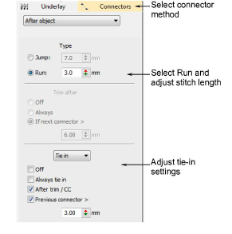

# Use runs as connectors

|  | Use Docker > Object Properties to toggle the Object Properties docker on/off. Use it to set runs as connectors. |
| -------------------------------------------------------------- | --------------------------------------------------------------------------------------------------------------- |

You can use runs of single stitches to connect objects in a design. Because runs cannot be trimmed, they are visible on the final embroidery, unless another object is digitized to cover them.

## To use runs as connectors...

1. Click the Object Properties icon and select the Connectors tab.

2. Select a connector method:

| Option        | Function                                                                                                                                                                                                                                  |
| ------------- | ----------------------------------------------------------------------------------------------------------------------------------------------------------------------------------------------------------------------------------------- |
| After object  | Allows you to adjust settings of connectors immediately following the current object.                                                                                                                                                     |
| Inside object | Allows you to adjust settings of connectors joining letters within a lettering object, and motifs within motif runs. This setting also applies to disconnected parts of branched objects. It does not apply to segments within an object. |

3. Select Run and enter a length for the connecting run stitches.

4. Adjust Tie In settings as required. The Tie Off and Trim After options are disabled as they do not apply to travel runs.

## Related topics...

- [Adjusting travel run stitch length](Adjusting_travel_run_stitch_length)
