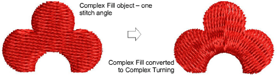
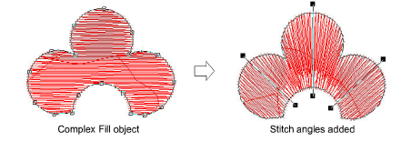
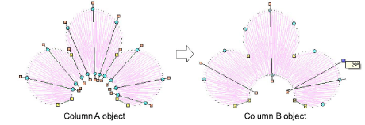

# Add angles in stitch angles mode

|              | Use Graphics Digitizing > Stitch Angles to add stitch angles to selected objects.                                 |
| -------------------------------------------------------- | ----------------------------------------------------------------------------------------------------------------- |
|  | Use Graphics Digitizing > Remove Stitch Angles to remove stitch angles from closed objects with turning stitches. |

Add [stitch angles](../../glossary/glossary) to most [embroidery objects](../../glossary/glossary) interactively using the Stitch Angles tool. Create embroidery objects by adding stitch angles directly to [vector objects](../../glossary/glossary).

## To add stitch angles in stitch angles mode...

1. Select an object and click Stitch Angles.

2. Digitize stitch angles so that they intersect two sides of the object.

3. Press Enter. The object is displayed in Reshape mode.

4. Holding down the Ctrl key, click the outline wherever you want to place an additional stitch angle.

Note: To remove all except the default stitch angle, select the object and click Remove Stitch Angles.
