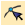
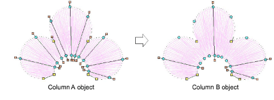
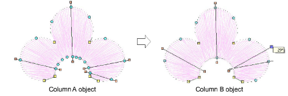

# Add stitch angles in Reshape mode

|        | Use Reshape > Reshape Object to add stitch angles to selected objects.                                    |
| ---------------------------------------------------- | --------------------------------------------------------------------------------------------------------- |
|  | Use Reshape Views > Show Stitch Angles to toggle stitch angle display when using the Reshape Object tool. |

Adjust or add [stitch angles](../../glossary/glossary) to [embroidery objects](../../glossary/glossary) interactively using the Reshape Object tool.

## To add stitch angles in Reshape mode...

1Select the object.

2Click the Reshape Object icon and click Show Stitch Angles to view only these [control points](../../glossary/glossary).

3Click-and-drag stitch angle points to adjust.

Tip: Column A objects automatically convert to Column B as soon as you add or adjust a stitch angle. You cannot add stitch angles to [Complex Fill](../../glossary/glossary) objects in Reshape mode.

4Holding down the Ctrl key, click the outline wherever you want to place an additional stitch angle.

5Press Enter.

## Related topics...

- [Converting designs with CorelDRAW Graphics](../../Automatic/automatic/Converting_designs_with_CorelDRAW_Graphics)
