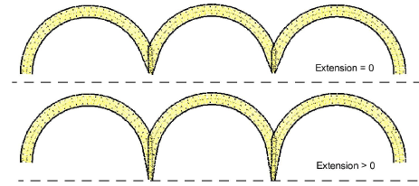

# Adjust smart corner settings

|  | Use Stitch Effects > Mitre Corners to create sharp lines at intersections of two columns. Right-click to adjust settings. |
| ------------------------------------------------------ | ------------------------------------------------------------------------------------------------------------------------- |
|      | Use Stitch Effects > Cap Corners with very sharp corners to generate fewer stitches. Right-click to adjust settings.      |
|      | Use Stitch Effects > Lap Corners for ‘Tidori’ style stitching. Right-click to adjust settings.                            |

You can set different angles at which Smart Corners will be applied, and specify overlap and stitch length allowances. Right-click a Smart Corners icon to access object properties.

## Cap corners

Cap provides the following settings:

- Cap below: angle below which to apply capped corners – any corners greater than this are not capped. The default is cap below 20°.

Tip: If Mitre Corners is also selected, the cap angle is usually smaller than the mitre angle.

- Overlap: number of overlapping rows to allow where the sections of the cap join.

- Max length: maximum length of cap stitches. Cap Corners with stitches exceeding this length will become Mitre Corners. This prevents long and short stitches appearing next to each other.

## Mitre corners

Mitre provides the following settings:

- Mitre below: angle below which to apply Mitre Corner – any corners greater than this are not mitred. The default is lap below 45°.

- Overlap: distance by which stitches are allowed to overlap in the center of the corner.

Tip: You can use Mitre Corner and Cap Corner options together. For example, you may want a corner less than 75° to be mitred but less than 45° to be capped.

## Lap corners

The Lap Corners feature provides good technical stitching in tight corners, as well as creative stitching effects. You have a choice of full overlap or split overlap methods, object-by-object. The split overlap method provides a variable amount of overlap at the corner. The Lap Below setting applies to either method and defines the angle below which Lap Corner will take effect. Any corners greater than this are not lapped. The default is lap below 110°.

With scalloped shapes, lap corners will always be applied since the corner angle approaches zero.

## Full overlap

Full Overlap provides a Max Extension setting. Technically, this is the extension of the corner point from the curve as a percentage of width. When set to zero, this setting achieves a blunting effect.

## Split overlap

When enabled, Split Overlap provides the following settings:

- Overlap: This setting provides a selectable amount of overlap between the two parts of a lapped corner. The effect is similar to a mitre corner but with different stitching.

- Max curve extension: extension of corner point from curve as a percentage of width. Curve shapes can have flat full or selectable pointed split overlaps. This parameter achieves a blunting effect, with similar practical application as round sharp corners.

Note: The Lap Corners effect is incompatible with mitre or cap corners. Turning it on will switch off the other two.

## Related topics...

- [Set corner fractions](../../Digitizing/input/Set_corner_fractions)
