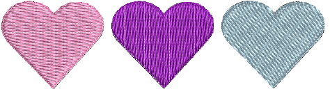

# Adjusting stitch angles

Stitch angle adjustments depend on object type. With [Complex Fill](../../glossary/glossary) objects you can set a single stitch angle for the entire object. You can add multiple stitch angles with the Stitch Angles tool. You can also adjust stitch angles with the Reshape Object tool.

## Related topics...

- [Add angles in stitch angles mode](Add_angles_in_stitch_angles_mode)
- [Add stitch angles in Reshape mode](Add_stitch_angles_in_Reshape_mode)
