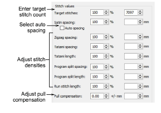

# Adjusting stitch densities

|  | Use Stitch > Process Stitches to adjust stitch density of and/or scale the whole or selected parts of a design. |
| -------------------------------------------------- | --------------------------------------------------------------------------------------------------------------- |

You may need to change stitch density in order to stitch on a different fabric or with a different thread. Or you may want to make production cheaper by reducing the overall stitch count. The Process Stitches feature lets you change the density of all stitch types (except [manual](../../glossary/glossary) stitch) across the whole or selected parts of a design. It also lets you adjust the density of selected stitch types. You can even use the feature to [scale](../../glossary/glossary) a design.

## To adjust overall stitch density...

- Select the design or objects you want to process.
- Click Process Stitches icon.

- In the Stitch Values panel:
- Enter Target Stitches either as a percentage or absolute value. This automatically adjusts density of each stitch type required to achieve the target stitch count.
- Optionally, adjust density for each stitch type. You can select spacing or length as a percentage of the original – from 10% to 1000% – or as an absolute value – e.g. in millimeters. If you do not want to change the density of a certain stitch type, leave it as 100%.
- Select the checkbox if you want to use [Auto Spacing](../../glossary/glossary) for satin stitching. If the checkbox is cleared, Auto Spacing will be removed from all selected satin objects and will change to fixed spacing. If the checkbox is dimmed, original Auto Spacing values are retained.
- In the Pull Compensation field, enter an amount by which to overstitch (or understitch) in order to compensate for fabric pull.
- In the Dimensions panel, adjust Width and Height values to [scale](../../glossary/glossary) selected objects.

- Click OK to apply. Stitches for Tatami, Satin, Run, Zigzag, and [Program Split](../../glossary/glossary) objects are regenerated.

Note: If a design was originally created in EmbroideryStudio, or was converted into objects, changes you make through the Process Stitches dialog will change [properties](../../glossary/glossary) of selected objects. You can check changes via the Object Properties docker.

## Related topics...

- [Satin stitching](../../Digitizing/stitches/Satin_stitching)
- [Working with fabrics](../../Digitizing/properties/Working_with_fabrics)
- [Compensating for fabric stretch](../underlays/Compensating_for_fabric_stretch)
- [Scale objects numerically](../../Modifying/transform/Scale_objects_numerically)
