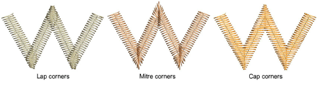

# Apply Smart Corners

|  | Use Stitch Effects > Mitre Corners to create sharp lines at intersections of two columns. Right-click to adjust settings. |
| -------------------------------------------- | ------------------------------------------------------------------------------------------------------------------------- |
|      | Use Stitch Effects > Cap Corners with very sharp corners to generate fewer stitches. Right-click to adjust settings.      |
|      | Use Stitch Effects > Lap Corners for ‘Tidori’ style stitching. Right-click to adjust settings.                            |

Use the Smart Corners feature to reduce the number of stitches and risk of bunched, distorted embroidery in sharp corners. Mitre Corners creates a sharp line at the intersection of two columns. Use it primarily for corner angles of 20° to 45°. Cap Corners is suitable for very sharp corners as it generates fewer stitches. Lap Corners is suitable for ‘Tidori’ style stitching. It can be applied to [Column C](../../glossary/glossary) and appliqué objects.

## To apply Smart Corners...

- Click a Smart Corners icon with or without objects selected. With no objects selected, smart corners are automatically generated for all new objects. Corners are based on [current properties](../../glossary/glossary).

- Click again to turn off the effect.

Note: You can also combine Smart Corners in [Column C](../../glossary/glossary) objects with sharp corner rounding.

## Related topics...

- [Adjust smart corner settings](Adjust_smart_corner_settings)
- [Round sharp corners](Round_sharp_corners)
- [Appliqué Embroidery](../../Applied/applique/Appliqué_Embroidery)
