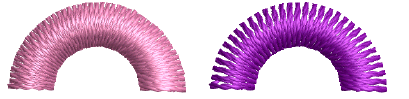
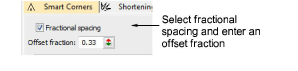
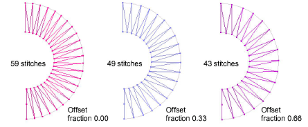

# Apply fractional spacing

|  | Use Stitch Effects > Fractional Spacing to even out stitch density along outside and inside edges. Right-click to adjust fractional spacing settings. |
| ------------------------------------------------------ | ----------------------------------------------------------------------------------------------------------------------------------------------------- |

Apply fractional spacing to curved shapes to even out stitch density along outside and inside edges. Fractional spacing is particularly useful for columns of satin stitches with sharp turns. For best results, combine [stitch shortening](../../glossary/glossary#stitch-shortening) and fractional spacing effects.

## To apply fractional spacing...

- Right-click the Fractional Spacing icon with or without objects selected to access object properties.

- Select the Fractional Spacing checkbox.
- In the Offset Fraction field, enter an offset as a fraction of column width, where the outside edge is 0.00 and inside edge 1.00.

::: tip
An offset fraction of 0.33 generates fewer stitches than standard spacing, reducing bunching along the inside edge. An offset fraction of 0.66 eliminates bunching on the inside edge, but may produce insufficient stitches to cover the fabric.
:::
