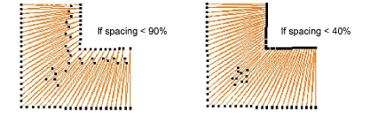

# Apply stitch shortening

|  | Use Stitch Effects > Shortening to reduce stitch bunching in tight curves by shortening some stitches on the inside edge. Right-click to adjust stitch shortening settings. |
| ---------------------------------------- | --------------------------------------------------------------------------------------------------------------------------------------------------------------------------- |

[Apply stitch shortening to sharp corners to decrease density on the inside edge. Default settings suit most designs. Advanced users can override with custom settings.](../../glossary/glossary)

## To apply stitch shortening...

- Right-click the Shortening icon with or without objects selected to access object properties.

- In the If spacing < field, enter the [minimum spacing](../../glossary/glossary) permitted between stitches (as % of nominal spacing) before automatic shortening takes effect.

- Enter the maximum number of consecutive short stitches to allow, up to a limit of five.

A higher number allows smoother distribution of needle penetrations in tight curves and reduces stitch bunching.

- Click the Settings button. The Stitch Shortening Settings dialog opens. Here you can define individual lengths of consecutive short stitches as a percentage of the original.

- A value of 80% means that stitches are shortened to 80% of the original length, not by 80%. The smaller the percentage, the shorter the stitch.

- If you allow three short stitches, you need only fill in the first three rows. If you allow five short stitches, fill in all five rows. If only one short stitch is generated between normal stitches, the value in Row 1 will apply. If two consecutive short stitches are generated, the values in Row 2 will apply to 1st and 2nd stitch respectively. And so on up the scale.

::: tip
For best results use a jagged pattern between consecutive stitches.
:::

- Select the Randomize checkbox to randomize the shortening pattern values. This will eliminate unwanted lines appearing in regular curves.

