# Corner handling methods

The following approaches can apply to both appliqué and standard satin (Column C) columns.

| Method       | Sample                                                             | Outline                                                            | Description                                                                          |
| ------------ | ------------------------------------------------------------------ | ------------------------------------------------------------------ | ------------------------------------------------------------------------------------ |
| No corner    | 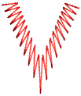       | 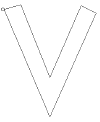       | Stitches curve around corners – standard Column C corner handling.                   |
| Mitre corner | 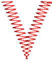         | 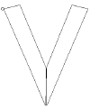         | Corners are formed by two segments that join in a sharp point.                       |
| Cap corner   | 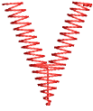             | 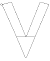             | Corner is capped by an extra segment – cap stitching remains parallel to the column. |
| Lap corner   | 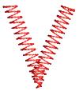 | 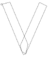 | Corner broken into two segments.                                                     |

## Corner rounding

A Round Sharp Corners option is available for [Column C](../../glossary/glossary) objects which can also be applied to sharp corners. The option is only available in conjunction with the [Smart Corners](../../glossary/glossary) effect. It is typically used with the Cap Corner option.

| Method             | Sample                                                           | Outline                                                          | Description                                                                                          |
| ------------------ | ---------------------------------------------------------------- | ---------------------------------------------------------------- | ---------------------------------------------------------------------------------------------------- |
| Rounded corner     | 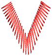       | 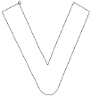       | Corner is sewn in one segment, with turning stitching, forming a round corner on the outer boundary. |
| Rounded cap corner | 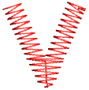 | 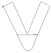 | The corner is sewn in three segments forming a round corner on the outside boundary.                 |
