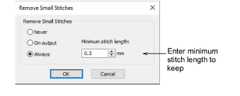

# Eliminating small stitches

Small stitches can damage fabric and cause thread or needle breakage. Before you stitch out, unwanted small stitches can be automatically removed. The filter can be applied continuously, on output only, or never.

## To eliminate small stitches...

- Select Design > Remove Small Stitches.

- Choose your preferred option:
- When set to ‘Always’, the filter will be automatically applied in the background whenever objects are edited or digitized.
- When set to ‘On Output’, the filter is only applied when printing or outputting files.
- Enter the [minimum stitch length](../../glossary/glossary) you want to preserve.
- Click OK to confirm.
- Check the Status Bar for the new stitch count.

## Related topics...

- [Other general options](../../Setup/settings/Other_general_options)
