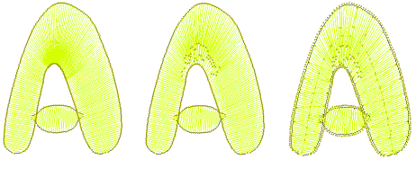

# Optimizing Stitch Quality

When it comes to embroidery production, the current stitch density may not be perfect for certain fabrics or threads. Or you may want to make production cheaper by reducing overall stitch count. After scaling operations, for example, designs may contain small stitches which can damage fabric and cause thread or needle breakage. Sharp corners may cause stitch bunching which can create hard spots in the embroidery and damage fabric or needle.

Embroidery machines have a maximum possible stitch length which is determined by the physical frame movement. If long satin stitches exceed this, they are broken into smaller stitches.

EmbroideryStudio helps you resolve all these issues with a number of specialized techniques for optimizing stitching quality for different design types and production requirements.

## Related topics...

- [Controlling stitch direction](Controlling_stitch_direction)
- [Removing underlying stitching](Removing_underlying_stitching)
- [Adjusting stitch angles](Adjusting_stitch_angles)
- [Adjusting stitch densities](Adjusting_stitch_densities)
- [Eliminating small stitches](Eliminating_small_stitches)
- [Controlling corner stitching](Controlling_corner_stitching)
- [Reducing stitch bunching](Reducing_stitch_bunching)
- [Optimizing long satin stitches](Optimizing_long_satin_stitches)
