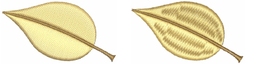
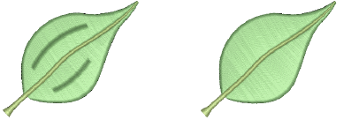

# Optimizing long satin stitches

Embroidery machines have a maximum possible stitch length which is determined by the physical frame movement. If a stitch exceeds this, it is generally broken into smaller stitches of equal length. The line formed by needle penetrations can affect the appearance of the embroidery, especially satin fills. Auto Split breaks long satin stitches into shorter ones. It also distributes needle penetrations in a random pattern so that they do not form a line down the middle of the shape.

If you want to preserve the satin effect – for example, if only a few stitches are too long – you can use Auto Jump instead. This preserves long stitches in an object by turning them into a series of jumps. Auto Split must be turned off for Auto Jump to take effect. Auto Jump is applied by [default](../../glossary/glossary) to [connectors. ](../../glossary/glossary)

::: info Note
The maximum frame movement is defined in the software by [format](../../glossary/glossary) values. [See Standard machine formats for details.](../../Setup/machines/Standard_machine_formats)
:::

## Related topics...

- [Split satin stitches](Split_satin_stitches)
- [Preserve long stitches](Preserve_long_stitches)
