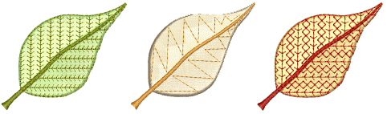
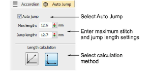
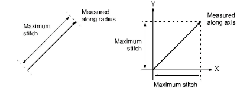
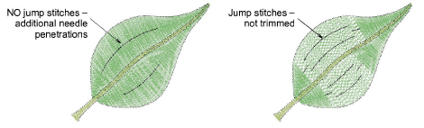

# Preserve long stitches

|  | Use Stitch Effects > Auto Jump to preserve long stitches in new and selected objects. Right-click to adjust settings. |
| ------------------------------------ | --------------------------------------------------------------------------------------------------------------------- |

Apply Auto Jump to satin objects with stitches that exceed the maximum stitch length. If the cover stitches are short, extending them with a jump makes them looser and thus more effectively raised off the fabric. Auto Jump can be used, for example, with manually digitized underlays. It can also be used to create quilted effects, for example, by applying it to satin areas that are over-stitched with Run stitch or [Motif Fill](../../glossary/glossary).

## To preserve long stitches...

1. Right-click the Auto Jump icon with or without objects selected to access object properties.

2. Select the Auto Jump checkbox.

3. In the Max length field, enter the maximum stitch length to allow. Stitches exceeding this value will have Auto Jump applied.

Note: This value must be smaller than or equal to the maximum stitch length possible for the selected [format](../../glossary/glossary).

4. Adjust Jump length as required.

Smaller jumps increase the time required to stitch out, but move the frame more smoothly across the design.

5. Choose a Length calculation method:

| Option       | Function                                                                     |
| ------------ | ---------------------------------------------------------------------------- |
| Along radius | Measures the distance between two consecutive needle penetrations.           |
| Along axis   | Measures either the horizontal or vertical movement required for the stitch. |

The option you select depends on the way your machine measures stitch length. See your machine documentation for details.

6. Press Enter or click Apply.

Caution: Many machines trim by jumps. Thus, to prevent the trimmers being activated, usually only one or two jumps between needle penetrations may be used.

## Related topics...

- [Stabilizing with automatic underlay](../underlays/Stabilizing_with_automatic_underlay)
- [Trim functions](../../Setup/machines/Trim_functions)
- [Standard machine formats](../../Setup/machines/Standard_machine_formats)
