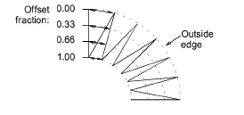
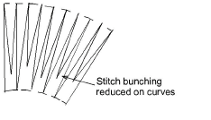

# Reducing stitch bunching

Standard stitch spacing is calculated at the outside edge of a shape. With sharp curves, spacing which provides adequate coverage on the outside edge may cause bunching along the inside edge. This may cause thread breakage when stitching out. The longer the stitches, the worse the problem.

With Fractional Spacing, EmbroideryStudio calculates spacing settings from a specified point called the ‘offset fraction’. Changing it adjusts stitch spacing at inside and outside edges.

Stitch Shortening reduces the length of some stitches in sharp turns so that needle penetrations are distributed evenly, creating smoother stitching.

## Related topics...

- [Apply fractional spacing](Apply_fractional_spacing)
- [Apply stitch shortening](Apply_stitch_shortening)
