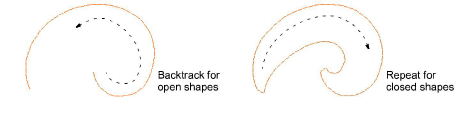

# Reinforce outlines

|  | Use Traditional Digitizing > Backtrack to reinforce an outline, stitching it in the reverse direction to the original. |
| -------------------------------------- | ---------------------------------------------------------------------------------------------------------------------- |
|        | Use Traditional Digitizing > Repeat to duplicate an outline in the same direction – typically used with closed shapes. |

Use Backtrack and Repeat to reinforce outlines. Backtrack stitches in reverse direction to the original. It is typically used to make run stitch outlines thicker without creating unwanted connecting stitches. Repeat duplicates the original stitching direction and is typically used with closed shapes.

## To reinforce outlines...

1. Select the outline (or outlines) to reinforce.

2. Click the Backtrack or Repeat icon as required:

- Backtrack for open shapes
- Repeat for closed shapes.

The object is duplicated and placed over the original. It is positioned after the original in the stitching sequence.

3. Check that the object has been duplicated by using one of the following methods:

- Check the stitch count in the Status Bar.
- Use Stitch Player.
- Travel through the stitches.

Note: If you use Repeat for open shapes, a connecting stitch is inserted from the end to the start of the next object which will require trimming.

## Related topics...

- [Simulate design stitchouts](../../Basics/view/Simulate_design_stitchouts)
- [Viewing stitching sequence](../../Basics/view/Viewing_stitching_sequence)
