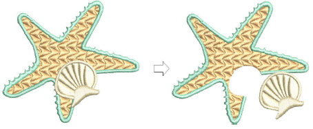
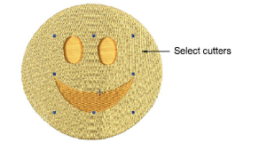
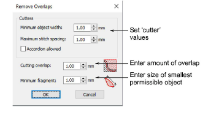
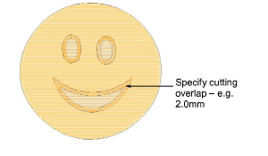
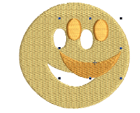

# Removing underlying stitching

|  | Use Appliqué > Remove Overlaps to remove underlying layer of stitching in overlapping objects using the selected object as a ‘cutter’. Right-click for settings. |
| ------------------------------------------------ | ---------------------------------------------------------------------------------------------------------------------------------------------------------------- |

Use the Remove Overlaps command to remove underlying stitching in overlapping objects. This helps to reduce stitch count and prevent a build-up of stitches.

## To remove underlying stitching...

- Select one or more ‘cutters’.

- Click the Remove Overlaps icon. Underlying stitching is removed using default settings. Alternatively, select Arrange > Remove Overlaps to access settings or right-click the tool.

- In the Cutters panel, adjust minimum object width and maximum stitch spacing as desired.

These settings are useful if, for example, you choose an entire design as a cutter and wish to exclude objects, such as borders or details, less than a certain width. The Maximum Stitch Spacing setting allows you to exclude background stitches of a certain density.

- Select Accordion Allowed to include Accordion Spacing objects. By default, the software treats these objects as backgrounds and excludes them from the cutting operation.
- Enter the amount of overlap required in the Cutting Overlaps field.

- In the Minimum Fragments field, enter the size of the smallest object that will be produced after cutting. This eliminates the generation of small objects and unnecessary color changes.
- Click OK. Underlaying stitching is removed.

::: tip
You can use an entire design as a cutter excluding objects, such as borders or details, less than a certain width.
:::

## Related topics...

- [Create partial cover appliqué](../../Applied/applique/Create_partial_cover_appliqué)
