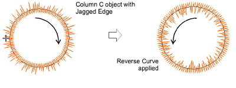

# Reverse stitch direction

| Use Edit > Reverse > Reverse Curves to reverse stitch direction in vector or closed embroidery objects. |
| ------------------------------------------------------------------------------------------------------- |

Stitching direction can affect embroidery quality because of the [push-pull](../../glossary/glossary) effect. The Reverse Curves command lets you control the push-pull effect by reversing stitch direction. It can be applied to open as well as closed outline objects. To reverse stitch direction, select an object and apply Edit > Reverse Curves. The command is also available from the popup (right-click) menu.

Reverse Curves can be applied to Run, E Stitch, Column C, Motif Run, and Sequin Run. It can also affect the stitching direction of Jagged Edge, Contour Stitch, Tatami offsets, and Flexi Split patterns.

Tip: [Vector objects](../../glossary/glossary) too can be reversed. The effect on vector objects is only visible when they are converted to embroidery.
