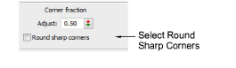
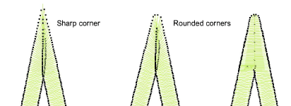

# Round sharp corners

|  | Right-click Traditional Digitizing > Column C to set sharp corner rounding. |
| -------------------------------- | --------------------------------------------------------------------------- |

A Round Sharp Corners option is available for [Column C](../../glossary/glossary) objects and can be applied to sharp corners. The option is only available in conjunction with the [Smart Corners](../../glossary/glossary) effect. It is typically used with the Cap Corner option.

## To round sharp corners...

1Double-click a Column C object or right-click the tool to access object properties.

2Select the Round Sharp Corners checkbox.

3Press Enter or click Apply.

