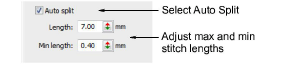
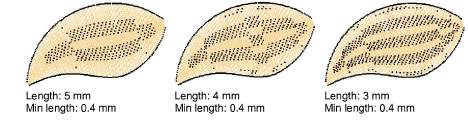
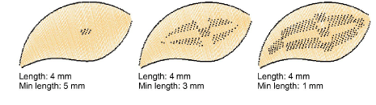
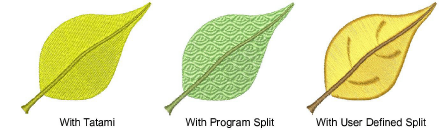

# Split satin stitches

|  | Right-click Fill Stitch Types > Satin to apply Auto Split to new or selected satin objects. |
| -------------------------------------- | ------------------------------------------------------------------------------------------- |

While Auto Split is used primarily to prevent long stitches in wide columns, it can also be used as an alternative to tatami fill. Auto Split looks more satin-like and works well with turning stitches, creating soft lines and a little more depth. By contrast, tatami is flat and can show unwanted patterns with tight curves.

## To split satin stitches...

1. Click the Satin icon with or without objects selected to access object properties.

2. Select the Auto Split checkbox.

3. Enter a [maximum](../../glossary/glossary) satin stitch length to allow before Auto Split is applied.

Stitches that exceed this value will be split into smaller stitches. This value can be smaller than the maximum stitch generally used in the design.

Tip: Use a length of 7.00 mm to preserve the satin effect.

4. In the Min length field, enter the shortest stitch that can be generated when using Auto Split.

5. Press Enter or click Apply.

Tip: As an alternative to Auto Split, try a textured tatami fill or [Program Split](../../glossary/glossary). Or, use User Defined Split to manage split lines in satin fills.

## Related topics...

- [Use jumps as connectors](../connectors/Use_jumps_as_connectors)
- [Patterned Stitching](../../Decorative/patterns/Patterned_Stitching)
