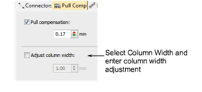
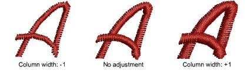

# Adjust column width

|  | Right-click Stitch Effects > Pull Compensation to adjust column width setting. |
| -------------------------------------------------------------- | ------------------------------------------------------------------------------ |

The Column Width setting adjusts the width of columnar shapes, allowing you to change the column width at every point by a constant amount in the direction of stitching. The purpose is to ‘fatten’ or ‘thin’ a column, for example, in order to create ‘bold’ lettering. [See also Format lettering.](../../Lettering/lettering_create/Format_lettering)

::: tip
Reduce column width if you need to allow the underlay to extend outside the object boundary.
:::

## To adjust column width...

- Right-click the Pull Compensation icon to access object properties.

- Select the Column Width checkbox and adjust as necessary.

## Related topics...

- [Apply automatic pull compensation](Apply_automatic_pull_compensation)
