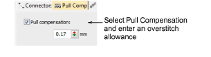
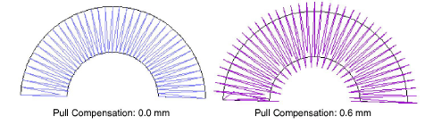

# Apply automatic pull compensation

|  | Use Stitch Effects > Pull Compensation to automatically compensate for fabric stretch. Right-click for settings. |
| ---------------------------------------------------- | ---------------------------------------------------------------------------------------------------------------- |

Apply automatic pull compensation to objects in your design and adjust as part of your quality checks prior to stitchout.

## To apply automatic pull compensation...

- Toggle automatic pull compensation on/off via the Pull Compensation button.
- Without objects selected, right-click the Pull Compensation icon to change [current settings](../../glossary/glossary#current-settings).
- With objects selected, right-click the Pull Compensation icon to change settings for those objects.

- Enter an overstitch allowance (in millimeters).

Appropriate pull compensation settings vary with the type of fabric – stretchy, pile, etc – hooping method – tight or loosely hooped – and size of embroidery object – wide or narrow columns. Use the following table as a guideline.

| Fabric         | Pull compensation (mm) |
| -------------- | ---------------------- |
| drills, cotton | 0.20                   |
| T-shirt        | 0.35                   |
| fleece, jumper | 0.40                   |
| lettering      | 0.2 - 0.3              |

## Related topics...

- [Working with fabrics](../../Digitizing/properties/Working_with_fabrics)
- [Working with object properties](../../Digitizing/properties/Working_with_object_properties)
