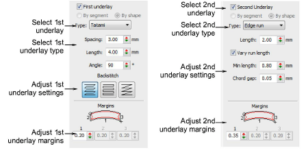
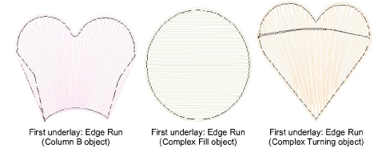
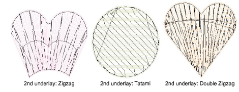

# Apply automatic underlay

|  | Use Stitch Effects > Auto Underlay to strengthen and stabilize embroidery designs with automatic underlays. Right-click for settings. |
| -------------------------------------------- | ------------------------------------------------------------------------------------------------------------------------------------- |

EmbroideryStudio provides a wide selection of underlay types to choose from. Use a single layer of underlay, or for more support, combine two underlay types. The underlay you choose is determined by the shape and size of object, fabric type, and purpose it is to serve. EmbroideryStudio lets you set values to suit different fabrics, lettering appearance and size.

## To apply automatic underlay...

- Toggle underlays on/off with the Auto Underlay button.
- Without objects selected, right-click the Auto Underlay icon to change [current settings](../../glossary/glossary).
- With objects selected, right-click the Auto Underlay icon to change settings for those objects.

- For a single underlay, tick the First Underlay checkbox and choose an underlay type from the droplist.

- For a double-underlay, tick the Second Underlay checkbox and choose a second underlay type.

## Related topics...

- [Working with fabrics](../../Digitizing/properties/Working_with_fabrics)
- [Working with object properties](../../Digitizing/properties/Working_with_object_properties)
- [Setting lettering underlay](../../Lettering/lettering_advanced/Setting_lettering_underlay)
