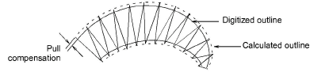

# Compensating for fabric stretch

Embroidery stitches tend to pull fabric inwards where the needle penetrates. This can cause fabric to pucker and gaps to appear in the embroidery. Experienced digitizers can manually compensate for pull by overlapping objects as they digitize. Automatic pull compensation, however, counters the pull effect by ‘overstitching’ outlines of filled shapes on the sides where the needle penetrates.

Adjust overstitching by varying pull compensation in the Object Properties docker. This is handy if you want to stitch a design on fabrics with varying degrees of stretch.

Tip: Applying underlay stitching, and using appropriate [backing](../../glossary/glossary) and [topping](../../glossary/glossary) when stitching out can also reduce the [push-pull](../../glossary/glossary) effect.

## Related topics...

- [Apply automatic pull compensation](Apply_automatic_pull_compensation)
- [Adjust column width](Adjust_column_width)
