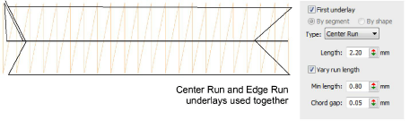
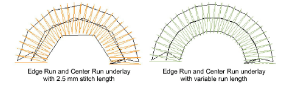

# Run stitch underlay settings

|  | Right-click Stitch Effects > Auto Underlay to adjust Center Run and Edge Run underlay settings. |
| ------------------------------------------------------ | ----------------------------------------------------------------------------------------------- |

Center Run places a row of stitches along the center of a column. It is used to stabilize narrow columns – e.g. 2-3 mm wide. Edge Run places stitches around the edge of an object. Use Edge Run together with the zigzag or tatami underlays when digitizing large shapes.

- Enter a stitch length for each underlay type. The samples below show the difference between fixed and variable run lengths.

- Adjust stitch length to ensure underlay stitches follow curves and are not visible in the final embroidery.

| Option          | Function                                                                                                                                                                                                |
| --------------- | ------------------------------------------------------------------------------------------------------------------------------------------------------------------------------------------------------- |
| Length          | Sets the maximum length of each stitch.                                                                                                                                                                 |
| Vary run length | If enabled, specify minimum stitch length and chord gap values. The chord gap is the distance between digitized curve and underlay stitch. This determines how closely stitches follow digitized lines. |

## Related topics...

- [Adjust column width](Adjust_column_width)
