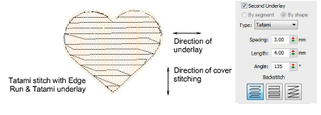
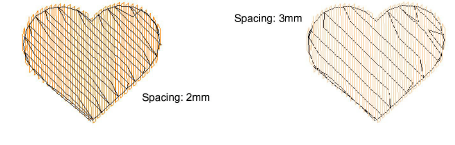
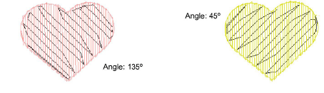
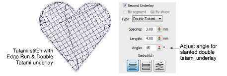

# Tatami underlay settings

|  | Right-click Stitch Effects > Auto Underlay to adjust tatami underlay settings. |
| ------------------------------------------------------ | ------------------------------------------------------------------------------ |

Tatami underlay is used to stabilize large, filled shapes. It resembles an extremely open tatami fill stitch, where rows of stitches are placed across the object to create the underlay. Tatami underlay is often used together with Edge Run, especially for [Complex Fill](../../glossary/glossary) objects under tatami cover stitching.

- Adjust stitch spacing and length settings for tatami underlay in the same way as for tatami fill stitches.

- Select the [backstitch](../../glossary/glossary) type you require and, for [Complex Fill](../../glossary/glossary) objects, set the [stitch angle](../../glossary/glossary) of the underlay stitches. Underlay stitch angle should run counter to cover stitching.

- For extra support with very soft or elastic fabrics, try using Double Tatami in combination with Edge Run. Adjust stitch angle so that Double Tatami provides symmetrical slanting in forward and backward directions. This should result in a ‘cross-hatch’ effect. In addition, it can give a raised surface similar to ‘puff embroidery’.

Tip: Increase the margin as necessary to prevent underlay stitches from extending outside the cover stitches.

## Related topics...

- [Tatami density](../../Digitizing/stitches/Tatami_density)
- [Other tatami settings](../../Digitizing/stitches/Other_tatami_settings)
- [Object property apply options](../../Setup/settings/Object_property_apply_options)
- [Underlay margins](Underlay_margins)
