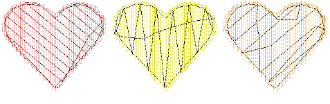

# Underlay & Pull Compensation

Embroidery stitches pull fabric inward where needles penetrate. This can cause [fabric](../../glossary/glossary) to pucker, [stitch bunching](../../glossary/glossary#stitch-bunching), and/or unsightly gaps to appear in the embroidery. EmbroideryStudio includes many techniques for achieving smooth, even placement of stitches, and the elimination of gaps in designs.

For an object to sew out correctly, it must have correct [stitch spacing](../../glossary/glossary#stitch-spacing), sufficient [pull compensation](../../glossary/glossary#pull-compensation), together with a suitable [underlay](../../glossary/glossary#underlay) for the particular combination of cover stitch type, object type, object shape, and fabric.

::: info Note
EmbroideryStudio provides a set of optimized [fabric settings](../../glossary/glossary#fabric-settings) that take into account the type of fabric you are stitching on. These settings are all [object properties](../../glossary/glossary#object-properties), some of which are entirely automated and some which you have control over. [See Object Properties for details.](../../Digitizing/properties/Object_Properties)
:::

## Related topics...

- [Stabilizing with automatic underlay](Stabilizing_with_automatic_underlay)
- [Compensating for fabric stretch](Compensating_for_fabric_stretch)
