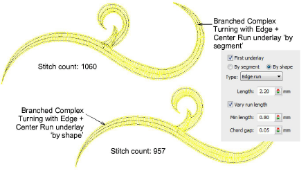

# Underlay by segment or by shape

Free shapes generally stitch out in several segments, joined by travel runs. However, all segments and boundaries are part of the same object. With the exception of lettering objects, underlay is normally applied segment-by-segment before any cover stitches are sewn.

‘By shape’ underlay is applied to lettering objects by default. However, it can also be applied to objects such as Complex Turning as well as branched objects. This has the effect of calculating an underlay for the whole shape rather than each segment. This in turn reduces bunching, travel runs, and overall stitch count. Depending on the size of object, however, registration issues may come into play.
