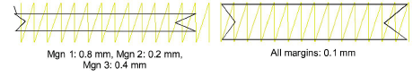

# Underlay margins

|  | Right-click Stitch Effects > Auto Underlay to adjust underlay margins. |
| ------------------------------------------------------ | ---------------------------------------------------------------------- |

The underlay margin is the distance between an object outline and the edge of the underlay. Increase this margin to prevent underlay stitches from extending outside the cover stitches.

- For Column A, Column B, Column C and Lettering objects, enter margins in the 1:, 2: and 3: fields, using the diagram as a guide.
- For [Complex Fill](../../glossary/glossary) objects, enter a margin in the 1: field only. Values in the other fields will be ignored.

- If you are joining two columns, use a negative value at the joining end. The underlay will extend outside the cover stitching, allowing for smooth joining of the columns.

