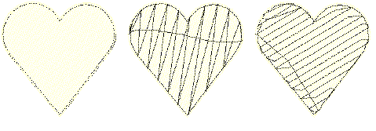

# Underlay types

Different underlays suit different shapes and different fabrics. Larger areas and stretchy fabrics such as knits and pique generally need more underlay than smaller areas and firm fabrics such as drill or leather. Smaller objects may use a single layer of underlay. Larger objects may combine two layers.

Underlay settings are stored with each object the same way as other [object properties](../../glossary/glossary#object-properties). They are regenerated whenever the object is [scaled](../../glossary/glossary) or transformed. They are stored separately from, and do not affect, cover stitch settings.

## Default underlay values

Default underlay values are derived from three possible sources:

- When Auto Fabric is turned on, a default underlay is applied, based on current fabric settings.
- When Auto Fabric is turned off and the ‘use preset styles’ option is turned on, style definitions are used. [See Digitizing presets for details.](../../Setup/settings/Digitizing_presets)
- When Auto Fabric is turned off and the ‘use preset styles’ option is turned off, template values are used. [See Working with templates for details.](../../Digitizing/properties/Working_with_templates)

## Related topics...

- [Digitizing presets](../../Setup/settings/Digitizing_presets)
- [Working with fabrics](../../Digitizing/properties/Working_with_fabrics)
- [Working with object properties](../../Digitizing/properties/Working_with_object_properties)
- [Setting lettering underlay](../../Lettering/lettering_advanced/Setting_lettering_underlay)
