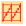
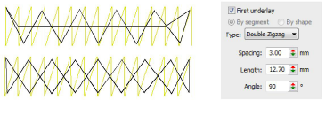
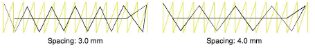
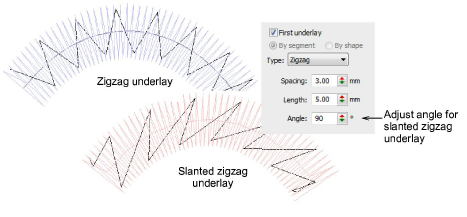
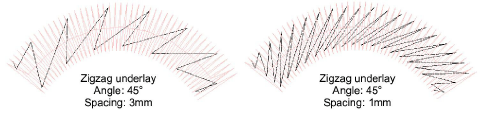
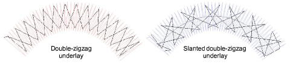

# Zigzag underlay settings

|  | Right-click Stitch Effects > Auto Underlay to adjust Zigzag and Double Zigzag underlay settings. |
| ------------------------------------------------------ | ------------------------------------------------------------------------------------------------ |

Use Zigzag and Double Zigzag underlay stitching to support wide columns. You can combine Zigzag or Double Zigzag with Center Run or Edge Run underlays. These underlays are best used under Satin cover stitching.

Adjust the required spacing and length for each underlay type.

EmbroideryStudio allows you to slant Zigzag underlay to create what is sometimes called ‘stemstitch underlay’. This can be applied to Column A, B, C, and lettering objects.

Normal zigzag underlay runs in a similar direction to satin cover stitching causing it to ‘sink’. Double Zigzag provides symmetrical slanting in forward and backward directions resulting in a ‘cross-hatch’ effect. This may provide more support than single zigzag. In addition, it can give a raised effect similar to ‘puff embroidery’.

Double Zigzag too can be slanted to create even more loft.

::: warning Caution
When using very small angles for slanted underlays, they can extend outside object boundaries.
:::

## Related topics...

- [Adjust column width](Adjust_column_width)
- [Underlay margins](Underlay_margins)
- [Setting lettering underlay](../../Lettering/lettering_advanced/Setting_lettering_underlay)
- [Open stitching](../../Decorative/specialty/Open_stitching)
