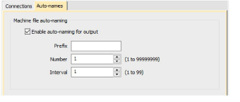

# Automatic machine file naming

Connection Manager provides an option for automatic machine file naming. When enabled, the specified filename format is used for all machine connections established in Connection Manager.

Where...

| Setting         | Details                                                                                                                       |
| --------------- | ----------------------------------------------------------------------------------------------------------------------------- |
| Filename format | Filenames take the format &lt;prefix&gt;&lt;number&gt;.&lt;extension&gt;                                                      |
| Prefix          | ASCII only, no Unicode characters. No Windows reserved characters. Length limit 8 characters.                                 |
| Number          | Numeric only. This sets the starting number. Range 1–99,999,999.                                                              |
| Interval        | Interval is numeric only and sets the number to increment each time a file is generated – e.g. ‘5’, ‘10’, etc. Range is 1–99. |

::: info Note
When enabled, Kiosk also uses this auto-name specification for all machine files. If not enabled, it uses the kiosk machine file definition.
:::

## Related topics...

- [Lettering Kiosk](../../Lettering/lettering_kiosk/Lettering_Kiosk)
